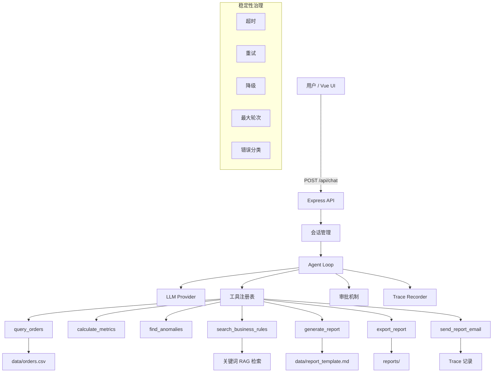

# business-agent-mvp

> 多工具经营分析 Agent

项目以订单经营分析为业务场景，提供订单查询、指标计算、异常识别、业务规则检索、报告生成、报告导出和邮件发送模拟。

## 项目亮点

- 将经营分析拆成可验证的工具链：查询、计算、异常识别、规则检索和报告生成各自独立。
- 中高风险操作进入审批流程，导出文件和发送邮件不会直接执行。
- 每次请求生成 Trace，前端可以查看 LLM 请求、工具调用、审批和错误信息。
- LLM 不可用或超时时使用本地报告流程，基础演示不依赖外部服务。
- 内置 demo 订单数据、HTTP 验收文件和工具层自动测试。

## 当前状态

| 能力 | 实现方式 | 状态 |
|---|---|---|
| 多工具编排 | 工具注册表 + Agent Loop | 已完成 |
| 结构化数据查询 | CSV + 确定性代码 | 已完成 |
| 指标计算 | `calculate_metrics` 确定性计算 | 已完成 |
| 异常识别 | `find_anomalies` 规则识别 | 已完成 |
| RAG 检索 | Markdown + 轻量关键词检索 | 已完成 |
| 审批机制 | 中高风险工具暂停等待用户确认 | 已完成 |
| Trace 可观测性 | API + 前端执行链路抽屉 | 已完成 |
| 前端 UI | Vue 3 + Vite + Tailwind + Lucide | 已完成 |
| 稳定性治理 | 超时、重试、降级、最大轮次、错误分类 | 已完成 |
| 工具并发 | 信号量控制 + 结果保序 | 已完成 |
| 测试 | Node test 覆盖关键工具逻辑 | 已接入 |

Demo 数据窗口为 `2026-05-25` 到 `2026-06-03`，共 200 笔订单。无 LLM fallback 模式使用该数据窗口。

## 架构



## 快速开始

### 1. 安装依赖

```powershell
pnpm install
```

### 2. 配置环境变量

```powershell
Copy-Item .env.example .env
```

`.env` 中不配置 `LLM_API_KEY` 时，后端会自动进入 fallback 模式，使用本地模板生成报告。

常用 LLM 配置：

```env
LLM_PROVIDER=openai
LLM_API_KEY=
LLM_BASE_URL=https://api.openai.com/v1
LLM_MODEL=gpt-4o-mini
```

DeepSeek 示例：

```env
LLM_PROVIDER=deepseek
LLM_API_KEY=
LLM_BASE_URL=https://api.deepseek.com
LLM_MODEL=deepseek-v4-flash
```

多模型 fallback 链示例：

```env
LLM_PROFILES=primary,backup,third

LLM_PRIMARY_PROVIDER=deepseek
LLM_PRIMARY_API_KEY=
LLM_PRIMARY_BASE_URL=https://api.deepseek.com
LLM_PRIMARY_MODEL=deepseek-v4-flash

LLM_BACKUP_PROVIDER=mimo
LLM_BACKUP_API_KEY=
LLM_BACKUP_BASE_URL=https://your-compatible-api.example.com/v1
LLM_BACKUP_MODEL=mimo-v2.5-pro

LLM_THIRD_PROVIDER=openai
LLM_THIRD_API_KEY=
LLM_THIRD_BASE_URL=https://api.openai.com/v1
LLM_THIRD_MODEL=gpt-4o-mini
```

配置多个 profile 后，系统会按 `LLM_PROFILES` 的顺序调用。`LLM_<PROFILE>_PROVIDER` 可填写任意标签，实际请求地址由 `LLM_<PROFILE>_BASE_URL` 指定。

### 3. 启动后端

```powershell
pnpm run dev
```

后端默认监听：

- API: `http://localhost:3001`
- 健康检查: `http://localhost:3001/api/health`

### 4. 启动前端

```powershell
pnpm --dir frontend run dev -- --host 0.0.0.0
```

前端默认访问：

- UI: `http://localhost:5173`
- API 代理: `http://localhost:3001`

### 5. 生产构建

```powershell
pnpm run build:all
```

构建后，Express 会托管 `frontend/dist`。未构建前端时，`public/index.html` 会显示基础提示页。

## 常用脚本

| 命令 | 作用 |
|---|---|
| `pnpm run dev` | 启动后端开发服务 |
| `pnpm run dev:ui` | 启动前端开发服务 |
| `pnpm run typecheck` | 后端 TypeScript 类型检查 |
| `pnpm run build` | 后端构建到 `dist/` |
| `pnpm run build:ui` | 前端类型检查 + Vite 构建 |
| `pnpm run build:all` | 后端 + 前端完整构建 |
| `pnpm run test` | 运行工具层测试 |
| `pnpm run check` | 后端类型检查 + 前端类型检查 + 测试 |

## API 示例

### 分析订单并生成报告

```powershell
curl -X POST http://localhost:3001/api/chat `
  -H "Content-Type: application/json" `
  -d "{\"message\":\"帮我分析本周订单情况，找出异常并生成经营分析报告\"}"
```

### 查看工具列表

```powershell
curl http://localhost:3001/api/tools
```

### 查看 Trace 列表

```powershell
curl http://localhost:3001/api/traces
```

## 演示流程

### 场景 1：普通经营分析

用户输入：

```text
帮我分析本周订单情况，找出异常并生成经营分析报告
```

重点观察：

- `query_orders` 查询 demo 订单数据。
- `calculate_metrics` 计算 GMV、净销售额、退款率和客单价。
- `find_anomalies` 识别大额订单、高退款和疑似刷单风险。
- `search_business_rules` 检索经营分析规则。
- `generate_report` 生成经营分析报告。
- Trace 中可以看到完整工具链路。

### 场景 2：导出报告审批

用户输入：

```text
帮我分析本周订单情况，生成经营分析报告，并导出为 weekly-report.md
```

重点观察：

- Agent 返回 `need_approval`。
- 前端显示审批卡。
- 用户点击确认后执行 `export_report`。
- Trace 记录 `approval_required`、`approval_result`、`tool_call`、`tool_result`。

### 场景 3：拒绝审批

用户输入：

```text
帮我生成报告并发送到 demo@example.com
```

操作方式：

- `send_report_email` 是 high risk 工具。
- 前端出现审批卡后选择拒绝。

重点观察：

- Trace 记录 `USER_REJECTED`。
- Agent 给出自然语言说明。
- 系统不会假装邮件已发送。

### 场景 4：LLM / 工具失败降级

触发方式：

- 不配置 `LLM_API_KEY`，系统进入 fallback 模式。
- 或将 `LLM_TIMEOUT_MS` 设置为很小的值，触发 LLM timeout。

重点观察：

- 系统仍可基于 CSV 数据生成本地模板报告。
- Trace 中出现 `fallback`。
- 报告中说明这是 fallback 结果。

## 审批流程

导出报告和发送邮件属于中高风险工具，Agent 会返回 `need_approval`，前端会渲染审批卡。

### 触发导出审批

```powershell
curl -X POST http://localhost:3001/api/chat `
  -H "Content-Type: application/json" `
  -d "{\"message\":\"帮我分析本周订单情况，生成经营分析报告，并导出为 weekly-report.md\"}"
```

返回示例：

```json
{
  "status": "need_approval",
  "traceId": "trace-xxx",
  "sessionId": "session-xxx",
  "approvalId": "approval-xxx",
  "toolName": "export_report",
  "riskLevel": "medium",
  "message": "工具 \"export_report\" (中风险) 需要用户确认后执行"
}
```

### 审批通过

```powershell
curl -X POST http://localhost:3001/api/approve `
  -H "Content-Type: application/json" `
  -d "{\"approvalId\":\"替换为实际 approvalId\",\"approved\":true}"
```

### 审批拒绝

```powershell
curl -X POST http://localhost:3001/api/approve `
  -H "Content-Type: application/json" `
  -d "{\"approvalId\":\"替换为实际 approvalId\",\"approved\":false}"
```

## Trace

访问 `GET /api/traces/:traceId` 查看完整执行链路。前端右侧抽屉会展示：

- 步骤数量、工具调用数量、错误数、累计耗时
- LLM 请求/响应
- 工具决策、工具调用、工具结果
- 审批等待和审批结果
- fallback 和最终回答
- 每一步的 JSON 详情

## 稳定性治理

| 治理手段 | 实现方式 | 配置 |
|---|---|---|
| 超时控制 | `withTimeout` 包裹工具执行 | `TOOL_TIMEOUT_MS=10000` |
| LLM 超时 | 单轮 LLM 调用超时后进入 fallback | `LLM_TIMEOUT_MS=30000` |
| 重试机制 | `withRetry` 对可重试错误重试 | `MAX_RETRY=2` |
| 最大轮次 | Agent Loop 最多 6 轮工具调用 | `MAX_TOOL_ROUNDS=6` |
| 并发控制 | 信号量限制并发工具数量 | `MAX_CONCURRENT_TOOLS=3` |
| 权限治理 | Critical 直接拒绝，中高风险审批 | 工具风险等级 |
| 降级策略 | RAG 失败返回空结果，LLM 失败用模板 | 内置 |
| 错误分类 | `AgentErrorCode` 枚举 | 内置 |

## 当前限制与生产化改造

本项目不是企业级完整系统，而是用于验证 Agent 工程关键控制点的 MVP：多工具编排、风险审批、稳定性治理、Trace 可观测性和 RAG / 工具 / LLM 的架构取舍。

### 审批存储

当前审批请求保存在内存 `Map` 中，服务重启会丢失。

生产化改造：

- 使用 Redis 或数据库持久化审批请求。
- 增加 TTL。
- 增加审批人身份。
- 增加审批幂等。
- 增加审批审计日志。

### 权限系统

当前实现风险等级策略：low 直接执行，medium / high 需要审批，critical 直接拒绝。

生产化改造：

- 接入用户身份。
- 按角色控制工具权限。
- 按数据范围控制可查询内容。
- 高风险动作接入企业审批流。

### 数据源

当前使用 CSV 模拟订单数据。

生产化改造：

- 替换为 MySQL / PostgreSQL / ClickHouse。
- 增加只读账号。
- 增加 SQL 白名单或查询 DSL。
- 增加查询审计。

### RAG

当前使用 Markdown + 关键词检索模拟 RAG。

生产化改造：

- 文档切片。
- embedding。
- 向量检索。
- 混合检索。
- rerank。
- 引用溯源。
- 权限过滤。

### Trace

当前 Trace 主要存在本地日志和本地 JSON 文件中。

生产化改造：

- 存入数据库。
- 支持按 `traceId`、`sessionId`、`toolName`、`status` 查询。
- 增加失败率、耗时、token 成本统计。
- 接入监控告警。

### 多实例部署

当前 MVP 更适合单机本地演示。

生产化改造：

- session、approval、trace 使用外部存储。
- 工具执行增加幂等。
- 审批恢复支持跨实例可用。

## 测试与验收

### 自动测试

自动测试文件位于 `tests/tools.test.ts`，覆盖工具层关键风险点：

| 覆盖点 | 验证内容 |
|---|---|
| `query_orders` | 日期范围校验、demo 数据读取 |
| `calculate_metrics` | GMV、净销售额、退款率、客单价 |
| `find_anomalies` | 大额订单、高退款日 |
| `export_report` | 只能写入 `reports/`，防路径穿越 |
| `toolRegistry` | 默认参数不误标为 required |

运行单测：

```powershell
pnpm run test
```

运行完整检查：

```powershell
pnpm run check
```

### HTTP 手动验收

手动 API 验收文件位于 `test.http`，适合 VS Code REST Client 或 JetBrains HTTP Client。

`test.http` 覆盖：

- 基础端点：健康检查、工具列表、会话列表、Trace 列表。
- Fallback 模式：无 `LLM_API_KEY` 时自动查询 demo 数据并生成报告。
- LLM 模式：指标分析、异常分析、规则检索、报告生成。
- 多轮会话：复用 `sessionId` 连续追问。
- 审批流程：导出报告审批通过/拒绝、邮件发送审批。
- 错误场景：缺少字段、空消息、不存在的审批、Trace 不存在。
- 复杂任务：地区对比、渠道退款分析、快速连续请求。

使用前先启动后端：

```powershell
pnpm run dev
```

然后打开 `test.http`，按分组逐条执行即可。

## Roadmap

### 已完成

- [x] 多工具编排闭环
- [x] 风险分级 + 审批机制
- [x] 超时、重试、降级、最大轮次
- [x] Trace 可观测性与前端可视化
- [x] RAG 业务规则检索
- [x] LLM + fallback 报告生成
- [x] 多轮对话上下文
- [x] 前端工作台 UI
- [x] 工具并发控制
- [x] 工具层测试

### 后续可扩展

- [ ] 添加客户分析、产品分析、趋势预测工具
- [ ] 接入 SQLite / PostgreSQL
- [ ] 增加角色权限和审计日志
- [ ] 增加端到端 UI 测试
- [ ] 对比不同 LLM 的报告质量
- [ ] 将 Trace 持久化到数据库

## License

MIT
